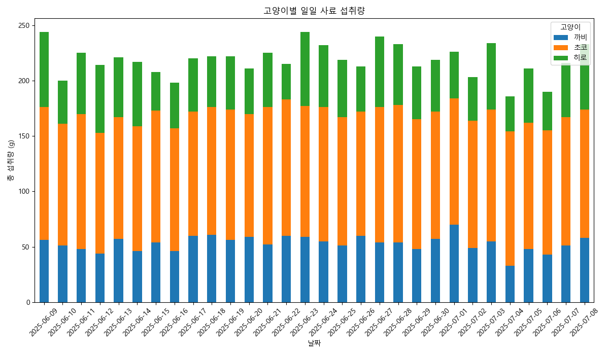
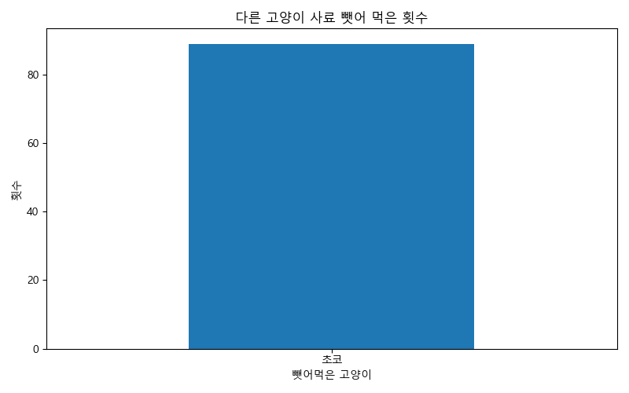
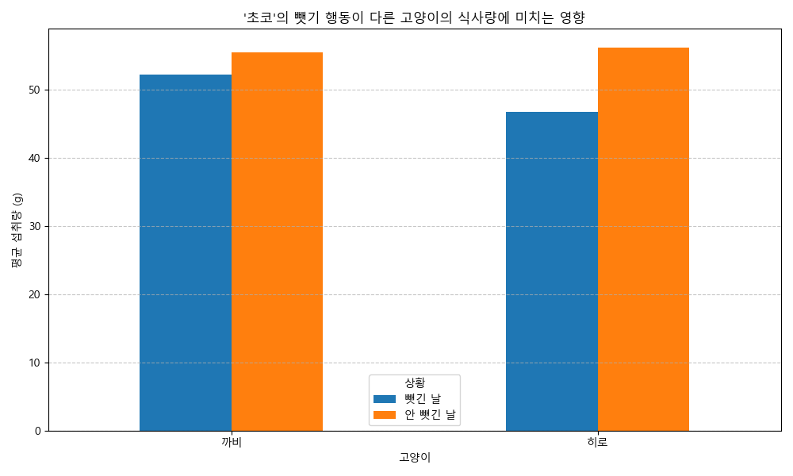

# 냥이네 종합 건강 리포트 (2025-07-09)

안녕하세요! 냥이네의 건강하고 행복한 삶을 위한 데이터 분석 리포트입니다.
지난 한 달간의 급여 데이터를 바탕으로 아이들의 식습관을 분석하고, 몇 가지 제안 사항을 담았습니다.

## 1. 데이터 분석 요약

### 고양이별 섭취량 분석
- **총 섭취량:** 초코(3489g)가 까비(1595g)와 히로(1470g)에 비해 월등히 많은 양을 섭취했습니다.
- **일일 평균 섭취량:** 초코(116.3g)는 다른 두 친구들(까비 53.2g, 히로 49.0g)보다 두 배 이상을 먹고 있습니다.

### 식습관 분석
- **사료 뺏어먹기:** '초코'가 다른 고양이의 사료를 총 89회 뺏어 먹은 것으로 확인되었습니다. 이는 초코의 섭취량이 비정상적으로 높은 주된 원인으로 보입니다.
- **뺏어먹기가 미치는 영향:**
    - **까비:** 사료를 뺏긴 날에는 평소보다 평균 3.25g의 사료를 덜 먹습니다.
    - **히로:** 사료를 뺏긴 날에는 평소보다 평균 9.32g의 사료를 덜 먹어, 식사량에 더 큰 영향을 받는 것으로 나타났습니다.

## 2. 시각화 자료

### 일일 사료 섭취량

*(초코가 다른 고양이들보다 꾸준히 많은 양을 섭취하는 것을 볼 수 있습니다.)*

### 사료 뺏어 먹은 횟수

*(모든 사료 뺏기 행동은 초코에 의해 발생했습니다.)*

### 뺏기 행동의 영향력 비교

*(특히 히로가 사료를 뺏길 때 식사량이 크게 줄어드는 것을 확인할 수 있습니다.)*

## 3. 제안 사항

1.  **급여 환경 분리:** 식사 시간에 고양이들을 분리하여 각자의 밥그릇에서 안정적으로 식사할 수 있는 환경을 만들어주는 것을 권장합니다.
2.  **자동 급식기 활용:** 특정 고양이만 인식하는 마이크로칩 인식 자동 급식기를 사용하면, 원천적으로 사료를 뺏어 먹는 행위를 방지할 수 있습니다. '초코'의 식사량을 조절하고 다른 고양이들의 안정적인 식사를 보장하는 데 효과적일 수 있습니다.
3.  **지속적인 모니터링:** 현재와 같이 데이터를 꾸준히 기록하고 분석하여 아이들의 건강 상태와 식습관 변화를 지속적으로 관찰하는 것이 중요합니다.

## 4. 고양이별 상세 리포트

---

# 까비 건강 리포트 (2025-07-09)

**이름:** 까비
**분석 기간:** 2025-06-09 ~ 2025-07-08

## 주요 분석 결과

- **총 섭취량:** 1595g
- **일일 평균 섭취량:** 53.17g
- **사료 뺏긴 횟수:** 19회

## 상세 분석

까비는 꾸준한 식사량을 보이고 있으나, 초코에게 사료를 뺏기는 날에는 평균 식사량이 다소 감소하는 경향을 보입니다. 전반적으로 안정적인 식습관을 가지고 있지만, 다른 고양이의 방해 없이 편안하게 식사할 수 있는 환경이 제공된다면 더 좋을 것입니다.

---

# 초코 건강 리포트 (2025-07-09)

**이름:** 초코
**분석 기간:** 2025-06-09 ~ 2025-07-08

## 주요 분석 결과

- **총 섭취량:** 3489g
- **일일 평균 섭취량:** 116.3g
- **사료 뺏어 먹은 횟수:** 89회

## 상세 분석

초코는 세 고양이 중 가장 많은 사료를 섭취하고 있으며, 이는 다른 고양이의 사료를 상습적으로 뺏어 먹기 때문인 것으로 분석됩니다. 과도한 사료 섭취는 비만 등 건강 문제로 이어질 수 있으므로, 식사량 조절 및 식습관 교정이 시급합니다. 마이크로칩 인식 자동 급식기 사용을 적극적으로 고려해볼 필요가 있습니다.

---

# 히로 건강 리포트 (2025-07-09)

**이름:** 히로
**분석 기간:** 2025-06-09 ~ 2025-07-08

## 주요 분석 결과

- **총 섭취량:** 1470g
- **일일 평균 섭취량:** 49.0g
- **사료 뺏긴 횟수:** 24회

## 상세 분석

히로는 초코에게 사료를 뺏기는 것에 가장 큰 영향을 받는 고양이입니다. 뺏기는 날에는 일일 평균 섭취량이 9.32g이나 감소하여, 안정적인 영양 공급에 차질이 생길 수 있습니다. 히로가 스트레스 없이 충분한 양의 식사를 할 수 있도록 독립된 식사 공간을 마련해주는 것이 중요합니다.
